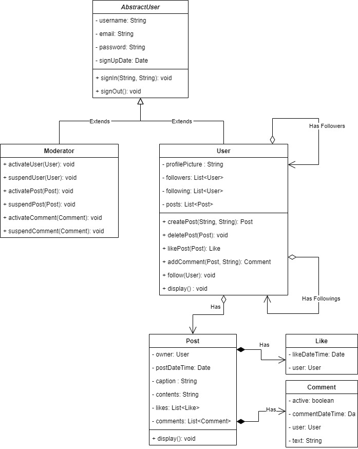

# ICS4U OOP Assignment

[*see instructions for details*](Instructions.md)

## Summary
*Include a brief summary that describes your system that your are modelling*

The system that I have created is one that models a user inferface for an Instagram application and its various features and interactions. The base of the user is an *AbstractUser*, which extends to a moderator and regular user. Both users have the ability to sign in and out of the account, and the sign up date is recorded. Depending on the user, there are different actions you can perform. A regular user is able to make and delete posts and comments, like other posts, and follow other users. A moderator is able to suspend comments and accounts so it is no longer visible to any users, but also activate a deactivated user or comment so it becomes visible again. Each individual post has an owner, time and date of post, and lists any likes and comments. Likes and comments also store the time and date of like and which user it belongs too. My system shows all the main features of an instagram post and the resulting likes and comments.